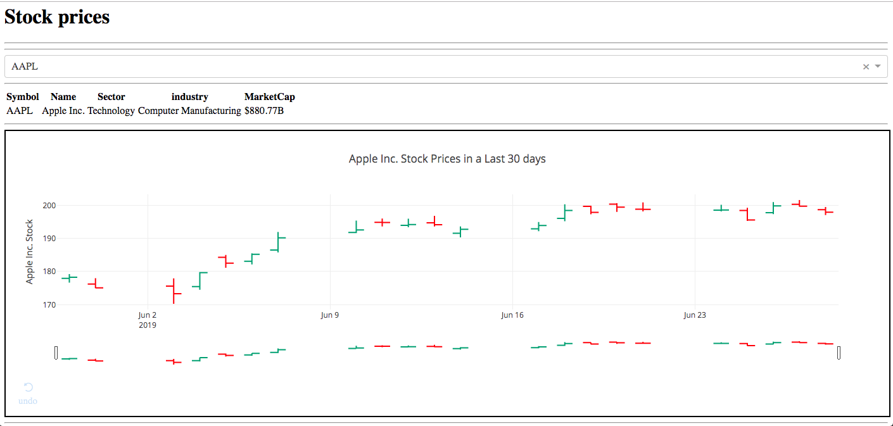
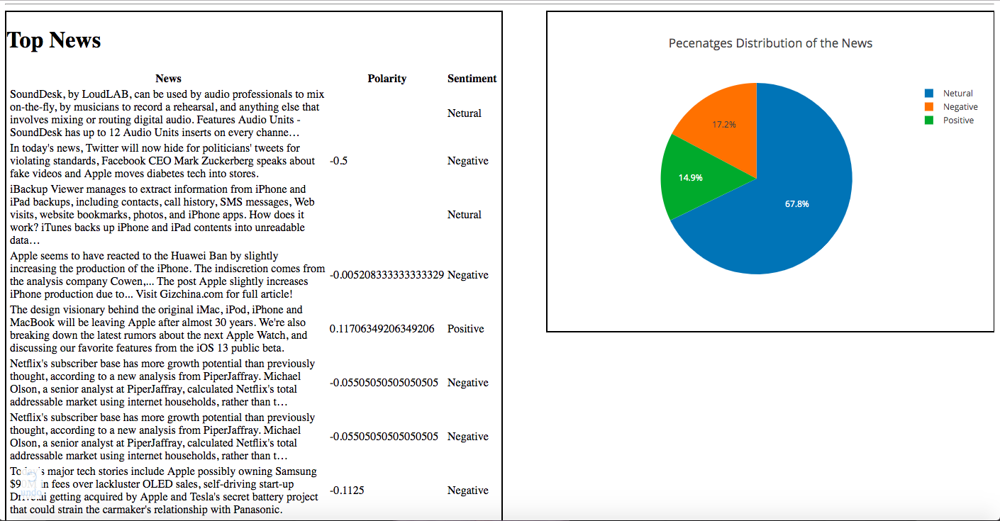

# Stock-Analysis

Dashboard build using dash plotly describing the stock of the selected company for a month and using NewsApi requesting all the news and performing sentiment analysis using textblob method. The App is deployed on Heroku.

# Amazon Alexia Review Shiny app:
Dash app: https://stockandsentimentanalysis.herokuapp.com/

## Stock OHLC Graph:

## Sentiment Analysis on News:

